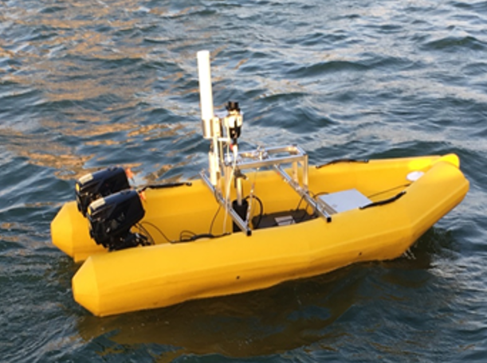
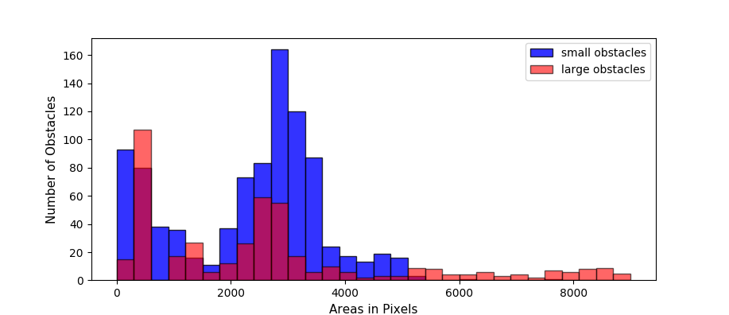
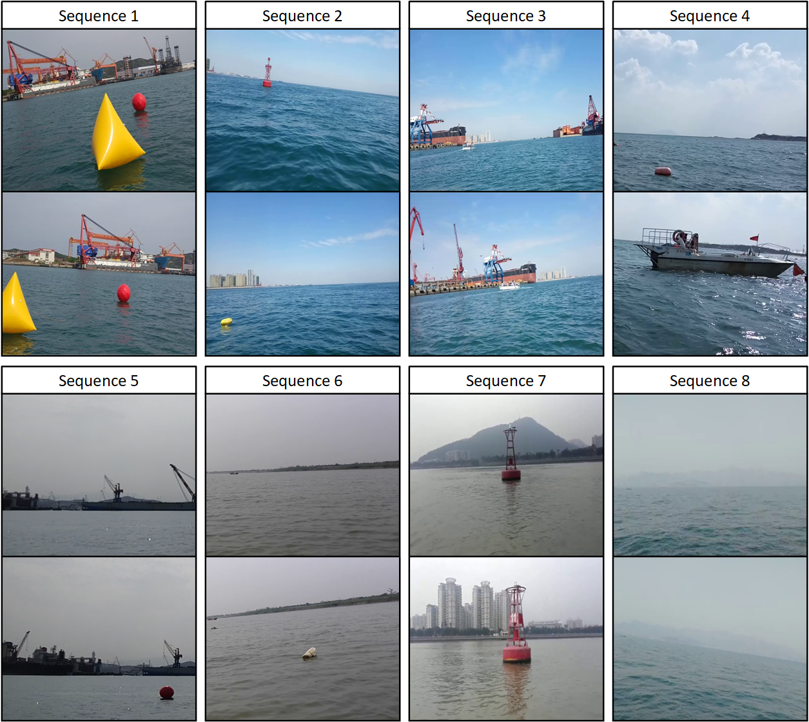

# Marine Image Dataset (MID)

​	This dataset  contains eight video sequences for marine obstacle detection. There are 2,655 labeled images with a resolution of 640 X 480 pixels in the dataset, which were captured from our Jinghai VIII USV (see Fig. 1). The USV is 2.7m long and adopts two-propeller electric propulsion that has the advantages of high thrust and flexible steering. It can reach a maximum speed of 7 knots. There are two industrial computers carried on the USV. One is mainly responsible for automatic navigation and obstacle avoidance, and the other is used for image acquisition and processing. A high-definition camera with a 50 degree field of view is mounted approximately 1 m above the water surface. The dataset have been acquired in the coastal waters of Qingdao and Shanghai, China, over several months at different times of day. It covers a range of different realistic conditions that coastal USVs encounter, including water reflections of the surrounding environment, visual blur caused by unfavorable weather conditions, low illumination, glitter or highlighted water areas caused by sunlight, and image jitter due to waves and USV motion. Obstacles in this dataset are separated into large obstacles (those that straddle the water edge) and small obstacles (those that are fully surrounded by water. The distribution of the annotated size of small and large obstacles is shown in Fig. 2. In addition, this dataset also provides ground truth data for the horizon.

Cite the paper：
J. Liu, H. Li, J. Luo, S. Xie, and Y. Sun. Efficient obstacle detection based on prior estimation network and spatially constrained mixture model for unmanned surface vehicles. J Field Robotics, 2020. DOI: https://doi.org/10.1002/rob.21983. 

Download link: https://pan.baidu.com/s/1bXU0dO6eYwcdG36f0zC5BA

Password: f276

Figure 1

Figure 2																			

There are some examples:

Figure 3
